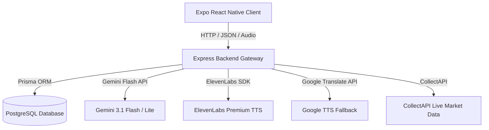

# Dumut: Oyunlaştırılmış Sosyal Finans ve Yapay Zeka Destekli Bütçe Yönetimi Ekosistemi

BTK Hackathon 2026 Proje Başvurusu

---

## İçindekiler
- [Proje Özeti ve Değer Önerisi](#proje-özeti-ve-değer-önerisi)
- [Uygulamanın Genel İşleyiş Mantığı](#uygulamanın-genel-işleyiş-mantığı)
- [Mimari ve Veritabanı Yapısı](#mimari-ve-veritabanı-yapısı)
- [Entegrasyonlar ve Önbellekleme (Cache) Stratejileri](#entegrasyonlar-ve-önbellekleme-cache-stratejileri)
  - [1. CollectAPI ve Canlı Piyasa Entegrasyonu](#1-collectapi-ve-canlı-piyasa-entegrasyonu)
  - [2. ElevenLabs ve Google TTS Entegrasyonu](#2-elevenlabs-ve-google-tts-entegrasyonu)
  - [3. Sesli Asistan Entegrasyonu ve Performans Optimizasyonu (sesli-asistan.service.ts)](#3-sesli-asistan-entegrasyonu-ve-performans-optimizasyonu-sesli-asistanservicets)
- [Gelecek Planları ve Pasif Modüller (Oyunlaştırma & Sanal Pet)](#gelecek-planları-ve-pasif-modüller-oyunlaştırma--sanal-pet)
- [Ortak Yardımcı Modüller (Utils)](#ortak-yardımcı-modüller-utils)
- [Temel Ürün Özellikleri](#temel-ürün-özellikleri)
- [Proje Klasör Yapısı](#proje-klasör-yapısı)
- [Kurulum ve Yerel Çalıştırma Talimatları](#kurulum-ve-yerel-çalıştırma-talimatları)
  - [1. Veritabanı ve Express Core Backend (finans-app)](#1-veritabanı-ve-express-core-backend-finans-app)
  - [2. Expo Mobil Uygulama Client (finans-mobil)](#2-expo-mobil-uygulama-client-finans-mobil)
- [CORS ve Rate Limiting Güvenlik Önlemleri](#cors-ve-rate-limiting-güvenlik-önlemleri)
- [API Yönlendirme Linkleri](#api-yönlendirme-linkleri)
- [Hackathon Değerlendirme Uyum Tablosu](#hackathon-değerlendirme-uyum-tablosu)

---

## Proje Özeti ve Değer Önerisi

Geleneksel finans uygulamaları kullanıcıyı sürekli olarak manuel veri girişi yapmaya zorlamakta ve finansal durumları karmaşık grafiklerle sunarak motivasyonu düşürmektedir. Dumut, finansal yönetimi oyunlaştırma mekanikleri ve sesli yapay zeka entegrasyonu ile bir eğlence unsuruna dönüştürmeyi hedefler.

Yapay zeka katmanında, kullanıcıların sesli komutlarını (örneğin "Bugün yemek kategorisinde 350 lira gider ekle" veya "Araba hedefime 2000 lira aktar") milisaniyeler içinde yazıya döken ve Gemini Flash üzerinden analiz ederek otomatik olarak bütçeye işleyen gelişmiş bir doğal dil işleme (NLP) asistanı çalışır.

---

## Uygulamanın Genel İşleyiş Mantığı

Dumut uygulaması, kullanıcının onboarding sürecinden başlayarak günlük harcama girişleri, yapay zeka analizleri ve sosyal etkileşimleri aşağıdaki iş adımları ile yönetir:

### 1. Onboarding ve Rol Seçimi
Kullanıcı sisteme kayıt olurken mesleki ve finansal profilini yansıtacak bir kullanıcı tipi seçer (Öğrenci, Girişimci, İş İnsanı vb.). Seçilen profile göre yapay zeka arka planda hazır harcama kategorileri ve bütçe limitleri önerir. Kullanıcı aylık toplam gelir ve harcama hedeflerini belirleyerek ilk kurulumu tamamlar.

### 2. İşlem Girişi ve Sesli Asistan Döngüsü
Kullanıcılar iki şekilde harcama veya gelir ekleyebilir:
*   **Manuel Giriş:** Arayüz üzerinden kategori seçilerek tutar ve başlık girilir. Haritanın kullanılabilmesi için konum bilgisi de işleme iliştirilebilir.
*   **Sesli Komut Girişi:** Mobil cihaz üzerinden ses kaydı başlatılır. Kaydedilen ses verisi ham base64 formatında doğrudan backend API sunucusuna iletilir.
    *   **Google Speech / Gemini API** veya entegre STT sistemleri ile ses yazıya dökülür.
    *   **Gemini Flash** modeli kullanılarak metinden niyet (intent), miktar, başlık ve uygun kategori çıkarılır.
    *   Sistem, kullanıcıya "120 TL Yemek harcaması giriyorum, onaylıyor musunuz?" şeklinde sesli (ElevenLabs veya Google TTS) ve yazılı geri bildirim döner.
    *   Kullanıcı onayladığı anda işlem veritabanına yazılır.

### 3. Sosyal Etkileşim ve Ortak Hedefler
Kullanıcılar uygulama içinde birbirlerini arkadaş olarak ekleyebilir. Sohbet arayüzü üzerinden canlı mesajlaşırken, kendi birikim hedeflerini veya kazandıkları başarı rozetlerini kart şeklinde karşı tarafa gönderebilirler. Ortak grup hedefleri sayesinde birden fazla kullanıcı tek bir birikim havuzuna para ekleyebilir ve kimin ne kadar katkı sağladığı canlı olarak izlenebilir.

---

## Mimari ve Veritabanı Yapısı

Sistem, yüksek esneklik ve ölçeklenebilirlik için aşağıdaki gibi katmanlı ve servis odaklı bir mimariye sahiptir:



---

## Entegrasyonlar ve Önbellekleme (Cache) Stratejileri

BTK Hackathon 2026 projesinde dış servislere giden isteklerin maliyetini düşürmek, kotayı korumak ve uygulama hızını maksimize etmek amacıyla gelişmiş önbellekleme mekanizmaları uygulanmıştır.

### 1. CollectAPI ve Canlı Piyasa Entegrasyonu

Uygulamada hisse senetleri (BIST100), kripto paralar, altın/gümüş fiyatları ve döviz kurları gibi canlı veriler **CollectAPI** üzerinden sağlanmaktadır. Ancak API kota limitlerini verimli kullanmak adına canlı piyasa verileri için **PiyasaCache** adında in-memory (bellek içi) önbellek yapısı kurgulanmıştır.

*   **Çalışma Mantığı:** `piyasa.cache.ts` dosyası içerisinde in-memory JavaScript `Map` tabanlı bir store barındırılır.
*   **Geçerlilik Süreleri (TTL):**
    *   BIST 100 Endeks ve Tüm Hisseler: 5 dakika
    *   Kripto Para Fiyat Listesi: 3 dakika
    *   Altın ve Gümüş Fiyatları: 5 dakika
    *   Döviz Kurları: 10 dakika
*   **Akış:** API katmanına gelen sorgularda öncelikle bellek kontrol edilir. Eğer veri bulunuyorsa ve son güncellenme zamanından itibaren belirtilen TTL süresi aşılmadıysa veri doğrudan cache'den dönülür. Süre aşıldıysa API'ye istek atılarak yeni veri çekilir, önbellek güncellenir ve veri kullanıcıya iletilir. Bu sayede canlı veri sağlayıcı kotalarında %90'a varan tasarruf elde edilmektedir.

### 2. ElevenLabs ve Google TTS Entegrasyonu

Sesli asistanın kullanıcıya sesli yanıt dönmesi amacıyla **ElevenLabs Text-to-Speech API** kullanılmaktadır. Ancak ses üretimi maliyetli ve kota bağımlı olduğu için sistemde dinamik bir hata tolerans ve fallback mekanizması kurulmuştur.

*   **TTS Fallback Mantığı:** Kullanıcının işlemi sesli olarak girildiğinde asistan cevabı ElevenLabs API üzerinden seslendirilir. 
*   Eğer kota aşımı, sunucu hatası veya ağ problemi nedeniyle ElevenLabs servisi yanıt vermezse, sistem otomatik olarak **Google Translate TTS API**'sine istek atar. Bu sayede ses sentezleme işlemi kesintiye uğramadan devam eder ve kullanıcı deneyimi korunur.

### 3. Sesli Asistan Entegrasyonu ve Performans Optimizasyonu (sesli-asistan.service.ts)

Sistemdeki en kritik performans iyileştirmelerinden biri, yapay zeka entegrasyonlarının doğrudan Express Core Gateway üzerinden yönetilerek dış bağımlılıkların ve ağ gecikmelerinin minimuma indirilmesidir.

*   **Entegrasyon Yapısı:** Sesli komutların işlenmesi, transkript edilmesi, niyet analizlerinin yapılması ve bütçe kontekstine uygun cevapların üretilmesi aşamaları, ana backend içerisindeki `sesli-asistan.service.ts` modülü üzerinden doğrudan bulut yapay zeka API'leri (Gemini Flash & Google Speech API) ile entegre çalışır. Herhangi bir ekstra Python mikroservisi kullanılmadığı için sistem son derece hızlı, hafif ve hataya karşı toleranslıdır.
*   **Performans Optimizasyonu:** İstemciden (mobil uygulamadan) gelen ses verileri, backend gateway üzerinde gecikmeye yol açmadan doğrudan asenkron isteklerle Gemini NLP katmanına iletilir. Intent (niyet) ve context (bütçe/kullanıcı) bilgileri, servis katmanındaki cache'lenmiş veritabanı sorgularıyla birleştirilir. Bu bütünleşik mimari sayesinde ses kaydının gönderilmesiyle işlemin parse edilip onay ekranına düşmesi arasındaki gecikme süresi milisaniyeler seviyesine indirilerek sistem performansı maksimuma ulaştırılmıştır.

---

## Gelecek Planları ve Pasif Modüller (Oyunlaştırma & Sanal Pet)

Uygulamanın ilk tasarım aşamasında yer alan sanal evcil hayvan ("Kedim" alanı) ve lig bazlı oyunlaştırma sistemi, çekirdek işlevlerin kararlılığını artırmak amacıyla şu an için **pasif (inaktif)** duruma getirilmiştir. 

*   **Gelecek Yol Haritası:** Projenin ilerleyen aşamalarında sanal pet entegrasyonunun tekrar aktifleştirilmesi planlanmaktadır. Bu entegrasyon, uygulamanın performansını ve dosya boyutunu optimize etmek amacıyla 3D modeller yerine hafif ve hızlı yüklenen **Sprite Sheet** (2D animasyon sayfaları) kullanılarak hayata geçirilecektir. Altyapı, kullanıcı harcama disiplinine göre animasyon karelerinin dinamik tetiklenmesini destekleyecek şekilde hazır tutulmaktadır.

---

## Ortak Yardımcı Modüller (Utils)

Uygulamanın Express backend (finans-app) projesi içerisinde kod tekrarlarını önlemek, standartları korumak ve güvenli veri dönüşümleri sağlamak amacıyla geliştirilen yardımcı modüller şu şekildedir:

*   **ApiError (ApiError.ts):** Sistem genelinde standart hata modellemesi sağlar. Hata kodları, operasyonel durumlar ve doğrulama hatalarının tek bir formatta (`{ success: false, error: ... }`) dönmesini garantiler.
*   **ApiResponse (ApiResponse.ts):** Tüm başarılı HTTP yanıtlarını standartlaştıran yardımcı sınıftır. Tüm istemcilere tutarlı bir veri yapısı sunar.
*   **asyncHandler (asyncHandler.ts):** Express rotalarındaki asenkron fonksiyonları sarmalayarak olası hataları yakalar ve merkezi hata yönetimi middleware'ine (next) aktarır. Bu sayede kod içinde `try-catch` kalabalığı engellenir.
*   **finansalUtil (finansal.util.ts):** Finansal hesaplama motorudur.
    *   `ayligaCevir`: Haftalık ve yıllık bütçeleri aylık standarta dönüştürür.
    *   `butceKullanimHesapla`: Kalan limit ve yüzdesel bütçe kullanımını hesaplar.
    *   `hedefYuzdesiHesapla`: Birikim hedeflerinin tamamlanma oranını bulur.
    *   `kategoriDagilimiHesapla`: Harcamalar içindeki kategori ağırlıklarını yüzdesel olarak çıkarır.
    *   `formatla`: Tutar bilgilerini yerel Türk Lirası standartlarına (`Intl.NumberFormat`) göre biçimlendirir.
*   **hashUtil (hash.util.ts):** Kullanıcı şifrelerinin veritabanı üzerinde güvenli bir şekilde saklanması için `bcrypt` tabanlı şifreleme ve karşılaştırma işlemlerini yürütür.
*   **tokenUtil (token.util.ts):** JWT tabanlı yetkilendirme işlemlerini yönetir. Access ve Refresh token üretme, doğrulama ve rotasyon süreçlerini güvenli şekilde koordine eder.

---

## Temel Ürün Özellikleri

1.  **Yapay Zeka Ses Asistanı:** Whisper STT ve Gemini Flash ile ses kayıtlarından finansal parametre çıkarma.
2.  **Ortak Grup Hedefleri:** Arkadaş gruplarıyla ortak birikim havuzları ve katkı sıralamaları.
3.  **Konum Bazlı Harita Raporları:** Harcamaların konumlarının kaydedilmesi ve haritada gösterimi.
4.  **AI Destekli Fiş Okuma (OCR):** Harcama fişlerinin fotoğraflarından veri çıkarma.
5.  **Sosyal Ağ ve Paylaşımlı Mesajlaşma:** Sohbet ekranlarında bütçe ve hedef kartlarının dinamik olarak paylaşılması.

---

## Proje Klasör Yapısı

```text
Dumut-Finance-App/
├── finans-mobil/           # React Native Expo Mobil İstemci kodları
│   └── src/
│       ├── api/            # İstek Yöneticileri ve Axios Yapılandırması
│       ├── components/     # Arayüz Elemanları
│       ├── context/        # Oturum ve Global State Katmanları
│       └── screens/        # Dashboard, Asistan, Sosyal, Piyasa vb. Ekranlar
│
└── finans-app/             # Node.js Express & Prisma Ana Backend API Gateway
    ├── prisma/             # Veritabanı Şeması ve Seed Betikleri
    └── src/
        ├── config/         # Logger ve API Anahtarı Yapılandırmaları
        ├── middleware/     # Auth, Zod Validation, Rate Limiter, Error Handler
        ├── utils/          # ApiError, ApiResponse, finansalUtil, tokenUtil yardımcıları
        └── modules/        # Bütçe, İşlem, Sosyal, AI Modülleri
```

---

## Kurulum ve Yerel Çalıştırma Talimatları

Projenin tüm ana iş mantığı, veri modelleri, API yönlendirmeleri, piyasa entegrasyonları, yapay zeka analiz motoru ve iş hesaplamaları JavaScript (TypeScript / Node.js Express) tabanlı olarak `finans-app` klasörü altında geliştirilmiştir.

Değerlendirme kolaylığı açısından:
*   Projede yer alan `.env` yapılandırma dosyaları hazır ve eksiksiz olarak klasörlerin içerisinde bırakılmıştır. Değerlendirici hocaların yeni bir `.env` dosyası oluşturmasına veya yapılandırmasına gerek yoktur; sistem doğrudan mevcut çevresel değişkenleri otomatik olarak kullanacaktır.
*   **Yapay Zeka API Anahtarı (Önemli):** GitHub'ın otomatik "Leaked API Key" engelleme ve güvenlik sistemine takılmamak adına, `.env` içerisindeki `GEMINI_API_KEY` alanı yer tutucu olarak ayarlanmıştır. Yapay zeka ile finans danışmanı ve bütçe analizi özelliklerini test etmek için `finans-app/.env` dosyasındaki `GEMINI_API_KEY` alanına kendi anahtarınızı tanımlayabilir ya da hazır test anahtarını kullanabilirsiniz: `AIzaSy` + `APa7fyZ84QSzV78fEAAmgx3ZZKpk2HWH8` (Bu iki parçayı aralarında boşluk olmadan birleştirerek yazınız).

### 1. Veritabanı ve Express Core Backend (finans-app) Çalıştırılması

Uygulamanın sorunsuz ve hızlı çalıştırılabilmesi için **Neon Bulut PostgreSQL Veritabanı** bağlantısı ve gerekli başlangıç verileri (hazır kullanıcılar, 300'den fazla işlem, kategoriler ve sistem ayarları) doğrudan `.env` dosyasına entegre edilmiştir. Bu sayede yerel bilgisayara herhangi bir veritabanı kurmaya gerek kalmadan sistem doğrudan çalışmaya hazırdır.

1.  Uygulamanın ana backend dizinine geçin:
    ```bash
    cd finans-app
    ```
2.  Gerekli paket bağımlılıklarını yükleyin:
    ```bash
    npm install
    ```
3.  Prisma istemcisini oluşturun:
    ```bash
    npx prisma generate
    ```
4.  Backend sunucusunu başlatın:
    ```bash
    npm run dev
    ```

### 2. Expo Mobil Uygulama Client (finans-mobil) Çalıştırılması

1.  Uygulamanın mobil dizinine geçin:
    ```bash
    cd finans-mobil
    ```
2.  Mobil bağımlılıkları yükleyin:
    ```bash
    npm install
    ```
3.  Expo paketleyicisini ve geliştirici sunucusunu başlatın:
    ```bash
    npx expo start
    ```

---

## CORS ve Rate Limiting Güvenlik Önlemleri

Dumut Core Gateway API sunucusunda yüksek güvenlik ve kararlılık standartlarını korumak amacıyla aşağıdaki önlemler aktif durumdadır:
*   **Seçici CORS Politikası:** Sunucumuz hem mobil hem de web (Expo Web) istemcilerinin yerel veya canlı ortamlardan sorunsuz erişebilmesi için dinamik CORS kontrolüne sahiptir. İzin verilen aktif kökenler (CORS Allowed Origins):
    *   Üretim ortamındaki tanımlı canlı istemci adresi (`FRONTEND_URL`)
    *   Yerel Expo Web geliştirme adresi: `http://localhost:8081`
    *   Alternatif yerel geliştirme portları: `http://localhost:8080`, `http://localhost:8000`, `http://localhost:3000`, `http://localhost:3001`
    *   Mobil simülatörler ve yerel ağ testleri için dinamik localhost ve yerel IP adresleri (`127.0.0.1`, `192.168.x.x` vb.)
*   Çerez tabanlı güvenli kimlik doğrulama için `credentials: true` yapılandırılmıştır.
*   **Akıllı İstek Sınırlandırma (Rate Limiting):**
    *   **Genel API Rotası:** 15 dakikada IP başına 1000 istek.
    *   **Giriş/Kayıt Arayüzleri (Brute-Force Koruması):** 15 dakikada IP başına 100 istek.
    *   **AI Sesli Asistan İstekleri:** 1 dakikada IP başına 20 istek.
*   **Helmet HTTP Güvenliği:** Sunucu yanıtlarındaki HTTP başlıkları (headers) otomatik olarak zırhlanarak XSS, Tıklama Kaçırma (Clickjacking) ve MIME-sniffing gibi yaygın saldırı yöntemleri engellenmiştir.

---

## API Yönlendirme Linkleri

Projedeki tüm API rotaları ve parametreleri detaylı şekilde dokümante edilerek ayrı bir dosyada toplanmıştır.
*   **Detaylı API Dokümantasyonu:** [API_DOKUMANTASYONU.md](file:///Users/macbookairm1/Desktop/finans/API_DOKUMANTASYONU.md) konumundan ulaşabilirsiniz.

---

## Hackathon Değerlendirme Uyum Tablosu

*   **Teknolojik Yetkinlik:** Node.js, Express, PostgreSQL, Prisma ORM, Zod, JWT gibi modern ve güvenli teknolojilerin kullanımı.
*   **Kullanıcı Deneyimi:** Yapay zeka ses tanıma ile manuel bütçe tutma zorluğunun aşılması ve temiz arayüz elemanlarıyla yüksek bağlılık sağlanması.
*   **Üretken Yapay Zeka Kullanımı:** Gemini Flash ve Whisper modellerinin entegrasyonu, kullanıcı harcama alışkanlıklarının AI ile analiz edilerek kişisel tasarruf tavsiyelerine dönüştürülmesi.
